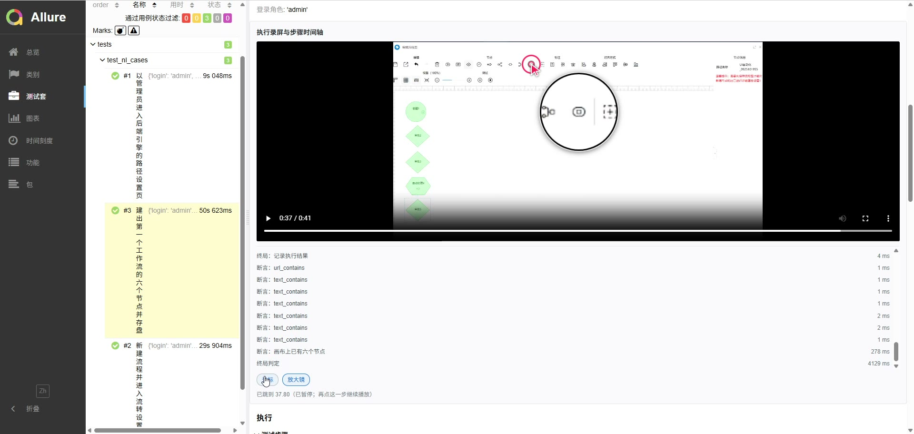

# jev-ui-test

**用一句自然语言驱动浏览器，把 UI 自动化测试写成用例、跑成回归、出成报告。**

用例用自然语言写（中文即可），pytest 执行，Allure 出报告。执行的是一个真正的浏览器 **agent**——
它自己看页面、自己决定「点哪个元素、做什么操作」，**没有选择器、没有站点脚本、没有预置的字段值**。

它 fork 自 [browser-use/jev-ultrafast](https://github.com/browser-use/jev-ultrafast)（MIT）：
上游是 Browser Use 的浏览器 agent 内核，本仓库把它改造成**跑测试**的框架——不重写内核，只在外围加一层。

**效率**：实测**每个操作决策中位 458 ms**，32 次操作决策里 **30 次在 1 秒以内**（p90 919 ms）；
而改造前用大模型直接驱动执行时，单个操作判断经常要 4–5 秒、个别到 10 秒。

[▶ 演示视频](#演示视频) · [📊 演示报告](#演示报告) · [快速开始](#快速开始) · [框架与改造详解](docs/framework.md) · [效率实测](docs/performance.md)

---

## 它解决什么问题

| | 传统做法 | 这里 |
|---|---|---|
| **用例怎么写** | 选择器脚本，页面一改就全红 | 写**自然语言**（YAML），元素表每次重算 |
| **一步多慢** | 大模型直接驱动：单个操作判断 4–5 秒、个别 10 秒 | 一次请求同时选出「操作 + 目标」，**中位 458 ms** |
| **失败怎么查** | 只有一张截图 | 报告带概率、请求体与响应、**操作坐标**、录屏 + 步骤时间轴 |
| **谁判定通过** | 模型说「完成了」 | **pytest 确定性断言**：语义证据给概率，阈值留在代码里 |

> 「4–5 秒 / 10 秒」是改造前的使用经验值，本仓库没有机器可读证据；458 ms 这一侧全部来自随仓库
> 分发的[演示报告](examples/allure-report/)，可逐步核对。口径见[效率实测](docs/performance.md)。

## 演示视频

<a href="examples/jev执行真实业务场景的测试报告录屏.mp4"></a>

**[▶ 观看完整录屏](examples/jev执行真实业务场景的测试报告录屏.mp4)**（3 分 57 秒 · 1452×680 · 7 MB）

录屏走一遍**一次真实项目的执行报告**（就是下面那份），依次是：

1. **报告首页**：3 条用例全绿，每条用例的 epic / feature / severity / tags / 耗时；
2. **用例详情**：`描述` 里是 YAML 中写的自然语言 `goal` 原文，`参数` 是本次运行参数；
3. **执行录屏与步骤时间轴**：点步骤跳视频、合成光标、3× 放大镜，以及逐条 `断言`；
4. **执行步骤表**：每步的候选元素数、选中操作、目标索引、操作概率、目标概率、置信度、
   决策耗时、重发次数、模型版本——**每一行都能拿去解释「它当时为什么这么点」**；
5. **environment**：环境信息与生效的执行参数，可事后核对。

## 演示报告

[`examples/allure-report/`](examples/allure-report/) 是一次**真实项目**的执行报告，对应
[`cases/e9/workflow_design.yaml`](cases/e9/workflow_design.yaml) 的三条用例
（管理员进后端引擎的路径设置 → 新建流程并进入流转设置 → 在图形编辑器里建出六个节点并存盘），
**3 passed**。

**开启 allure 服务查看报告**（别直接双击 `index.html`，浏览器会拦本地文件请求）：

```bash
uv sync                                  # 第一次：装依赖（含 allure-pytest==2.13.5）
allure open examples/allure-report       # 起本地服务，打开【已生成】的报告
```

allure CLI 需要 Java。要从原始结果起服务用 `allure serve report/allure-results`；
**不要用 `python -m http.server` 代替**——它不支持 HTTP Range，录屏进度条拖不动。

> 这份报告随仓库一起分发。要自己产出一份，见[快速开始](#快速开始)第 4 步。

## 快速开始

**1. 装**

```bash
git clone https://github.com/buer2233/jev-ui-test.git
cd jev-ui-test
uv sync
cp .env.example .env        # 填入 TYPESAFE_API_KEY 与 TEXT_MODEL_API_KEY
```

需要 Python ≥ 3.12，Chrome 通过 [Browser Harness](https://github.com/browser-use/browser-harness)
连接（`uv sync` 已装）。连不上时跑 `uv run browser-harness --doctor` 并按提示允许远程调试。

> **Windows 上起不来时**：导入期报 `UnicodeDecodeError` / `codec can't decode byte`，是中文
> Windows 的区域编码问题（不是依赖问题）；报 `DevToolsActivePort not found`，多半是
> **没有可连接的 Chrome**（不是权限没开）。排查步骤见 [`.claude/skills/run-jev/SKILL.md`](.claude/skills/run-jev/SKILL.md)。

**2. 配**（只有 E9 环境才需要）

```bash
cp config.example.json config.json    # 填 base_url 与 admin / employee1~5 账号
```

> ⚠️ **`config.json` 已被 `.gitignore` 忽略，且必须保持忽略**——本仓库是公开仓库，
> 真实账号与内网地址提交上去就是凭据泄漏。入库的只有占位模板 `config.example.json`。

**3. 写用例**（`cases/**/*.yaml`，用户只写自然语言）

- **手上已有功能测试用例** → 用 `/nl-case-author`，它把源材料转成下面的 YAML；
- **想直接看一条能跑的** → [`examples/weaver_site_tour.yaml`](examples/weaver_site_tour.yaml)，
  公开网站上跑、不需要 E9 环境也不需要 `config.json`（展示副本，执行源在 `cases/demo/`）。

```yaml
cases:
  - id: e9-workflow-add-bym
    name: 新建 BYM专用测试 流程并提交
    url: "{{ base_url }}/wui/index.html#/main/workflow/add"
    login: employee1                 # 接口登录后把 cookie 注入浏览器，用例免登录开跑
    goal: |
      1. 打开新建流程页面，页面上按分组列出了各种流程名称；
      2. 点击「BYM专用测试」，它会打开该流程的表单页面；
      3. 在「签字意见」里输入「同意流程」；
      4. 点击「提交」。
      提交成功后表单页会自动关闭，回到新建流程列表页；此时停止。
    expect_mode: and                 # 多断言合成口径：and / or / min_pass，逐用例决定
    expect:
      - type: ai                     # 语义断言：Jev 的 noul 给概率，阈值比较在代码里
        claim: 页面上显示的是新建流程的流程名称列表
      - type: text_not_contains      # 确定性断言
        value: "流转设定"
      - type: url_contains
        value: "/wui/index.html#/main/workflow/add"
```

两条硬约束（[AGENTS.md](AGENTS.md) 有完整版）：**断言只对【终局页面】求值**；
**agent 没有「后退」动作**，站点内换页要靠页面上的导航。

**4. 跑 + 看报告**

```bash
uv run pytest                     # 默认离线，自然语言用例不会跑：143 passed，6 skipped

# 显式请求才会执行（会调付费 API 并接管一个 Chrome 标签页）
uv run --env-file .env pytest tests/test_nl_cases.py --nl --reruns 1 \
  --alluredir=report/allure-results
allure generate report/allure-results -o report/allure-report --clean
uv run python scripts/install_report_plugin.py report/allure-report   # 二开插件：录屏 + 步骤时间轴
allure open report/allure-report
```

也可以用 `/nl-case-run`：你说「测一下新建流程」或「跑 cases/e9 下的用例」，它负责挑用例、
执行、出报告；如果该功能还没写成用例，会先转 `/nl-case-author`。

## 更多文档

| 文档 | 内容 |
|---|---|
| [框架与改造详解](docs/framework.md) | 改造边界、用例层 / 报告层 / 内核侧特色、框架怎么工作、源码导读、开发与校验 |
| [效率实测](docs/performance.md) | 决策耗时分布、与旧方案的口径对比、复现命令 |
| [设计说明](docs/design.md) | 内核机制：动态「操作 + 目标」、快照与身份、新鲜度与遮挡校验、等待策略 |
| [AGENTS.md](AGENTS.md) | 工程约定：分层边界、断言口径、重跑策略、凭据与仓库边界 |
| [`.claude/skills/`](.claude/skills/) | `/nl-case-author`、`/nl-case-run`、`/run-jev` 三个 skill 的说明 |

## 上游项目

浏览器 agent 内核由上游维护，本仓库是 [browser-use/jev-ultrafast](https://github.com/browser-use/jev-ultrafast) 的 fork。

> [!IMPORTANT]
> **The Browser Use Cloud waitlist is open.** Get early access to ultrafast browser agents in the cloud.
> **[Join the waitlist →](https://browser-use.com/ultrafast?utm_source=github&utm_medium=readme&utm_campaign=jev-ultrafast)**

---

## 友情链接

- [Linux do](https://linux.do/)