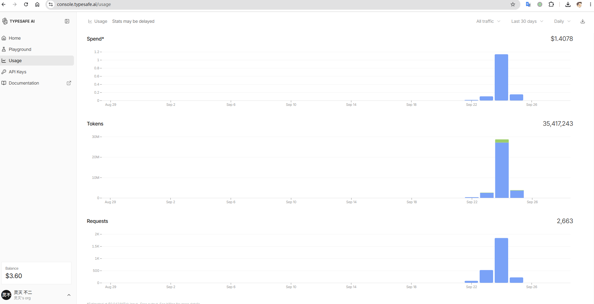

# Jev 模型介绍和使用教程

本框架里「点哪个元素、做什么操作」不是人写死的，也不是让大模型现编的，而是由 **[Jev 决策模型](https://typesafe.ai)**
在页面的候选元素里**打分选出来**的。这份文档前半段讲清楚 **Jev 是什么、它和常规大模型差在哪、为什么这个项目要用它**，
后半段是**怎么拿到 API Key，并用注册送的免费额度把本仓库的用例跑起来**。

---

## Jev 是什么

Jev 是 **TypeSafe 的 System One 模型**（System One Model）的第一个公开版本，专门为**自动化**而训练——
它要做的不是「找人聊天」，而是「替软件做决定」：

- **它的输出是决策，不是文字**：一次调用返回「在这个候选集合里选哪一个」，附带**带校准的概率**
  （每个候选各自的概率，以及这一次的置信度），而不是一段还需要再解析的自然语言；
- **它的训练目标和聊天模型不同**：TypeSafe 的说法是，RLHF 把模型训练得很会遵循指令，代价是
  「模式坍缩、过度自信、不可靠」；他们改用 RLCD（Reinforcement Learning for Calibrated Decisions），
  让模型**知道自己有多确定**，不确定就把概率说出来，由调用方决定要不要往上抛；
- **在浏览器里，它的动作空间是动态且带索引的**（上游 [jev-ultrafast](https://github.com/browser-use/jev-ultrafast) 的定位）：
  每次观察页面得到一张候选元素表，Jev 只在这张表里选；可选操作限定为 `CLICK` / `TYPE_TEXT` / `SELECT` /
  `SCROLL_UP` / `SCROLL_DOWN` / `WAIT` / `DONE` / `BLOCKED`；
- **一次请求同时返回两个决策**：「做什么操作」和「对哪个目标」（推测式 fan-out），只有被选中操作
  对应的那个目标头会被执行；
- **它不负责措辞**：需要输入文本时（操作是 `TYPE_TEXT`），由另外一个小语言模型按目标生成字段值；
- **它的输出到不了危险的地方**：模型输出永远不会变成选择器、坐标、shell 命令或可执行 JS。

## Jev 与常规大模型的区别

| | 常规大语言模型（LLM） | Jev 决策模型 |
|---|---|---|
| **输出什么** | 给人读的文字 / JSON，还要再解析成动作 | 给机器用的**类型化决策**：在候选集合里选索引，+ 每个候选的概率 |
| **优化目标** | 人类偏好（RLHF），指令跟随强 | **校准的决策**：确定就是确定，不确定要能说出有多不确定 |
| **输出的边界** | 可以输出任意字符串——包括不存在的选择器、坐标、JS | 输出只能落在**本次观察到的候选**里 |
| **置信度** | 不是它的输出物（token 概率 ≠ 决策置信度） | **每次决策自带**，可以直接拿去和阈值比较 |
| **一次决策的开销**（厂商口径） | 同一组对比里 LLM 侧 8.566 s / $0.01388 | 0.114 s / $0.000081；官网称「快 193.6×、省 444.6×」 |

> 最后一行是 **TypeSafe 官网口径**，不是本仓库实测，此处仅作参考；本仓库侧的实测在下一节。

## 为什么本项目的 UI 自动化要用 Jev

UI 自动化的每一步，本质是**在已经看得见的候选里做一次选择**，不是创作；而测试要的是**可重复、可判定、
可审计**——生成式输出那点「不确定性」，恰恰是测试最不想要的东西。所以这里不把截图丢给大模型让它「想」，
而是让 Jev 在候选表里「选」：

| | 大模型直接驱动 | Jev 决策模型驱动（本框架） |
|---|---|---|
| **模型输出什么** | 一段自由文本或 JSON，还要再解析成动作 | 在**本次观察到的候选元素里选索引**，选出来就是动作 |
| **会不会点到不存在的元素** | 会——选择器、坐标都是模型「写」出来的 | **结构上不能**：`choice` 必须落在候选 id 里、概率须归一、被选中的那条必须是最大值，否则整条响应被拒收并重发（`model.py` 的 `validate_choice`） |
| **一步多久** | 4–5 秒，个别 10 秒（改造前的使用经验，本仓库无机器可读证据） | Jev 一次请求同时给出「操作 + 目标」，**中位 458 ms**（p90 919 ms，来自随仓库分发的演示报告） |
| **不确定性怎么处理** | 文字里没有可用的置信度，只能「信」或「不信」 | 每步返回**带校准的概率**，可以当证据用 |
| **谁判定通过** | 常常是模型自己说「完成了」 | 概率只是**证据**，阈值与判定留在 pytest 代码里（`expect: type: ai`） |
| **失败怎么归因** | 一段模型输出 + 一张截图，得自己重看 | 报告逐行记候选数、目标索引、操作/目标概率、决策耗时、重发次数 |
| **成本** | 按 token 付费，长时间跑回归很贵 | 演示用例整套跑一遍：**2,663 次决策请求 / 3,542 万 token / $1.41**（控制台账单，见下文截图） |

**Jev 在其中起的关键作用**——它把「看页面 → 决定下一步」从**生成**换成了**打分**：

1. **动作空间是闭合的**：模型只能在当次快照出的候选里选，模型输出永远不会变成选择器、坐标或可执行 JS；
2. **一次往返出两个决策**：「操作 + 目标」在同一请求里返回（推测式 fan-out），只有被选中操作对应的那个目标头会被执行，
   省掉了「先想操作、再想目标」的第二次往返；
3. **概率可编程**：带校准的概率让框架能把**判定权留在代码里**——语义断言（`noul`）拿它当证据，阈值由人定；
4. **可审计**：每一步都是索引 + 概率 + 耗时的结构化记录，能逐行走查「它当时为什么这么点」。

---

## 使用教程

### 1. 注册，领 5 美元额度

1. 打开 TypeSafe 控制台：<https://console.typesafe.ai/home>
2. 用邮箱注册（无需绑卡）；**注册即送 5 美元调用额度**；
3. 左侧 **API Keys** → 新建一把 Key，复制出来（只显示一次，丢了就重建）。



> 上面是控制台的 **Usage** 页（近 30 天窗口）。本仓库的演示用例就是在这些请求里跑出来的：
> **2,663 次决策请求、3,542 万 token、$1.41**；左下角余额 **$3.60** —— 正好是注册送的 5 美元
> 花掉这些之后的余量。
> 换算成一句话：**把整套演示用例跑一遍，成本在「几美元」这个量级**，不是按分钟烧钱的那种。

### 2. 填进本项目

`cp .env.example .env` 之后，填两把 Key（它们是两个不同的模型，别混）：

```bash
TYPESAFE_API_KEY=...        # 第 1 步复制的那把：决定「操作 + 目标」
TEXT_MODEL_API_KEY=...      # 只在 TYPE_TEXT 时用来写字，可用任意 OpenAI 兼容端点
```

| 环境变量 | 谁提供 | 干什么 | 默认值 |
|---|---|---|---|
| `TYPESAFE_API_KEY` | TypeSafe | **决策**：在候选元素里选出「操作 + 目标」，并返回概率 | 无（必填） |
| `TEXT_MODEL_API_KEY` | DeepSeek / 通义 / OpenRouter… | **写字**：只有操作是 `TYPE_TEXT` 时才被调用 | 无（`TYPE_TEXT` 用例必填） |
| `TYPESAFE_MODEL` | TypeSafe | 决策模型的版本 | `jev-latest` |
| `TEXT_MODEL` | 同上 | 写字的模型 | `deepseek-chat` |

### 3. 它一次调用长什么样

一次决策 = 一个只读请求：`POST https://api.typesafe.ai/v1/systemone`（见 `jev_ultrafast/model.py`）。

- **发出去的**：`state` 是这一时刻页面的结构化快照（url / 标题 / 可见文本 / 候选元素表），
  `questions` 里一次问两件事 —— `operation`（做什么操作）与 `click_target` / `type_text_target` / `select_target`
  （每个操作各自的目标候选），**两个决策一次网络往返**；
- **回来的**：每个问题都有 `choice` + `confidence` + 每个候选的 `probabilities`。

三条硬校验（`validate_choice`）：选中的必须在本次候选表里、概率必须归一（和 ≈ 1）、被选中的那条必须是最大值。
不满足就**整条拒收并重发一次**——只重发这个只读的决策请求，浏览器动作一律不重发。

### 4. 怎么查用量

- **控制台**：Usage 页看 Spend / Tokens / Requests 与余额（就是上面那张截图）；
- **本项目侧**：报告里每一步都记了 `决策耗时`、`重发次数`、`模型版本`，跑完可以对着账单核。

### 5. 注意

- **Key 不要入库**：`.env` 已被 `.gitignore` 忽略，本仓库是公开仓库，提交上去就是泄漏；
- 免费额度用完需自行充值，用量与账单以控制台为准；
- 决策请求只读、重试安全；浏览器变更操作一律不重试（理由见 AGENTS.md「重跑」一节）。